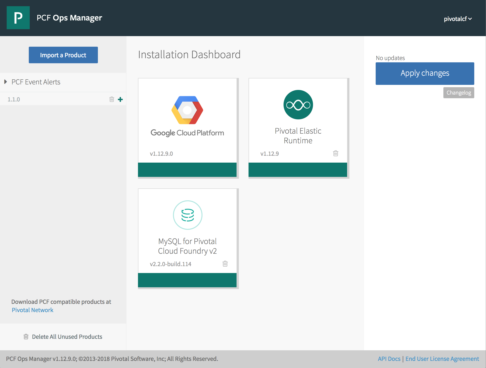
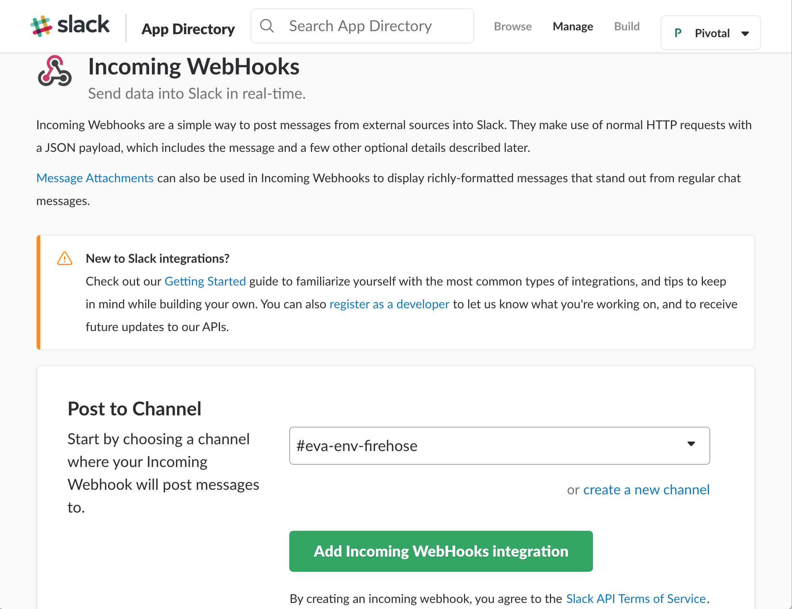
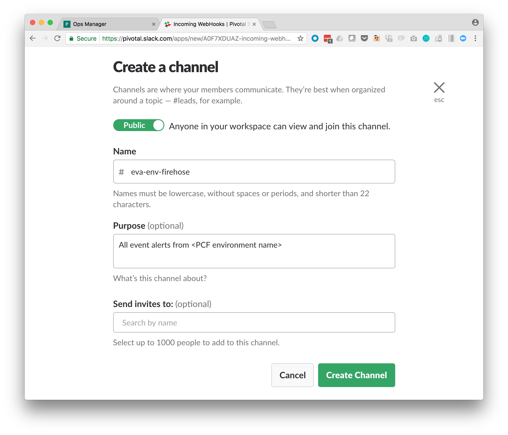
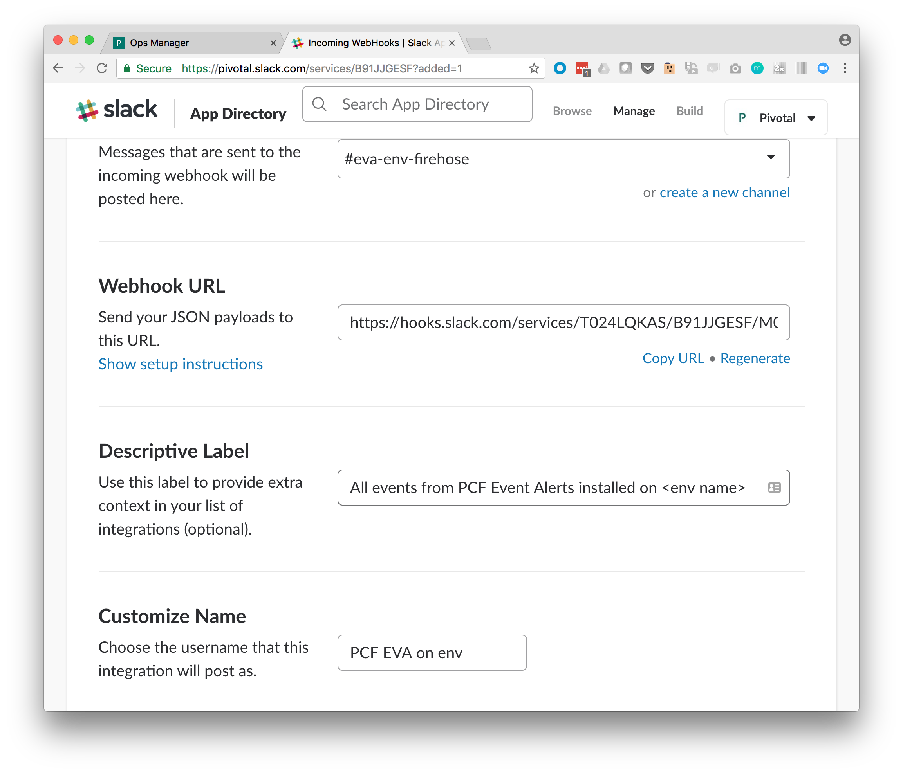
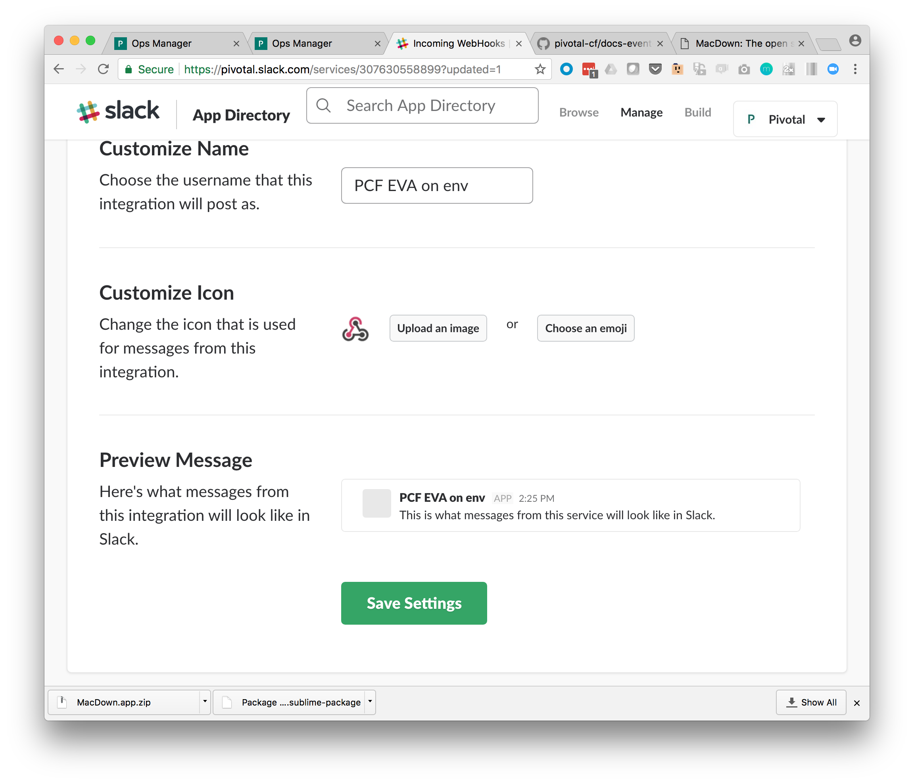
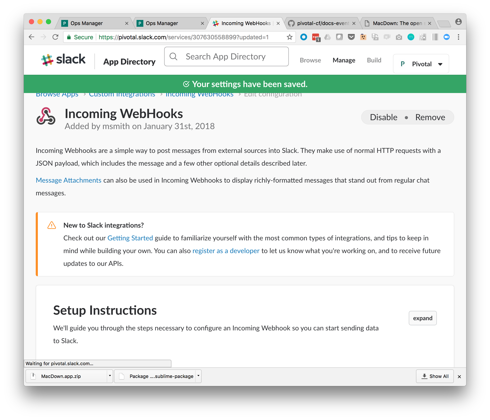
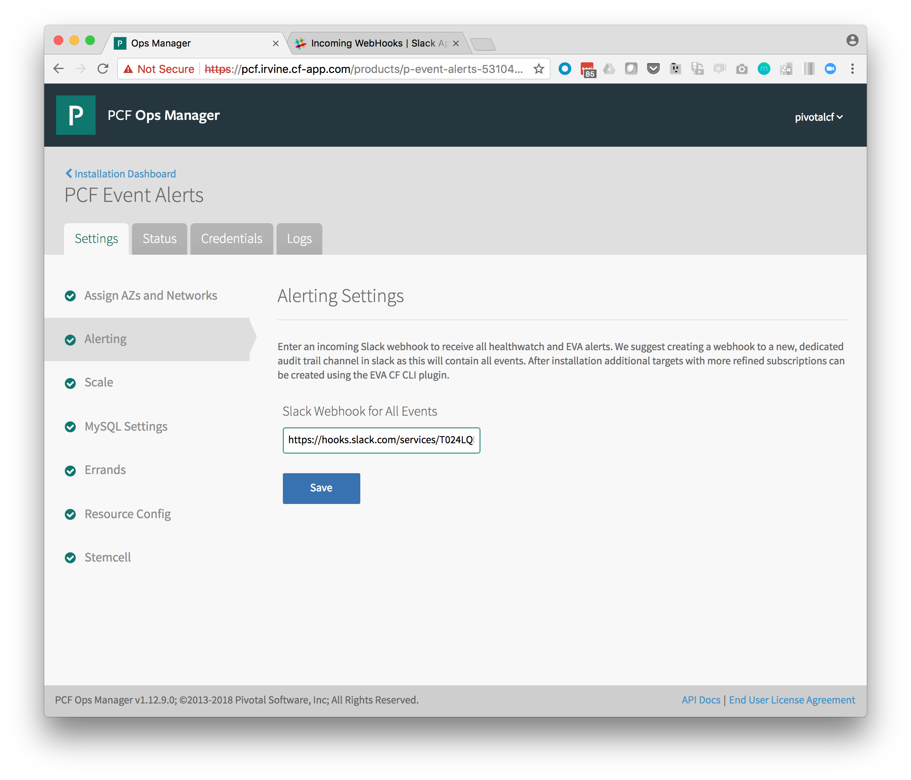
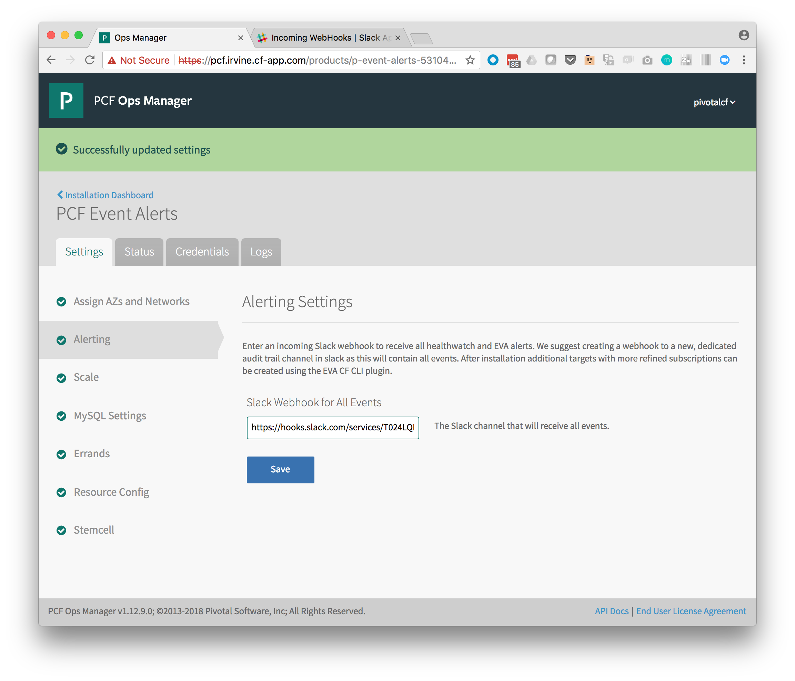

This topic describes how to install and configure PCF Event Alerts.

## Install and Configure PCF Event Alerts

###Prerequisites

1. PCF 1.12+ environment with Ops Manager
1. PCF MySQL v2 tile installed in Ops Manager or external MySQL credentials
1. Slack account for optional slack integration

###Installation

1. Download the product file from Pivotal Network.

1. Navigate to the Ops Manager Installation Dashboard and click **Import a Product** to upload the product file. 

1. Under the **Import a Product** button, click **+** next to the version number of PCF Event Alerts.
This adds the tile to your staging area.

1. Click the newly added **PCF Event Alerts** tile in orange.

##  Configure PCF Event Alerts

Follow the steps below to configure the PCF Event Alerts tile.

### Configure AZs and Networks

Follow the steps below to choose an Availability Zone (AZ) to run Event Alerts and to select networks.

1. Click **Assign AZs and Networks**.

1. Configure the fields as follows:

    <table class="nice">
      <tr>
        <th>Field</th>
        <th>Description</th>
      </tr>
      <tr>
        <td><strong>Place singleton jobs in</strong></td>
        <td>Select the AZ for executing the Event Alerts Errands. All Event Alerts components execute as apps and do not require VMs.</td>
      </tr>
      <tr><td><strong>Balance other jobs in</strong></td>
          <td>Ignore this field.</td>
      </tr>
      <tr>
        <td><strong>Network</strong></td>
        <td>Select a subnet for the Event Alerts Errands. Use the subnet that includes the Elastic Runtime component VMs.</td>
      </tr>
    </table>

    
<strong>NOTE</strong>: The network selected is used only by Errand VMs.

1. Click **Save**.

### Configure Event Alerts Alerting Options

1. Click **Alerting**.

1. Create an incoming webhook in slack: <https://my.slack.com/services/new/incoming-webhook/>

1. Click the _**create a new channel**_ link

1. Fill in the name and purpose then click the _Create Channel_ button
1. Scroll down and fill in the desccriptive Label and Customize Name fields

  

1. Scroll to the bottom of the page
  

1. Click **Save** (you should see _Your settings have been saved_)

  

1. Scroll to the Webhook URL section

  

1. Click **Copy URL** (you should see _Copied!_)

  

1. Return to Ops Manager Alerting tab and paste in the webhook URL

  

1. Click **Save** (you should see a _Successfully updated settings_ message)

  

### Configure Event Alerts MySQL Settings

    <strong>Note</strong>
    : PCF Event Alerts can either use the Pivotal MySQLv2 service broker or an external database for
    database configuration.

#### Using the MySQL Service
1. Click **MySQL Settings**.

1. Select either **MySQL Service** (for use with the Pivotal MySQLv2 tile)

1. Configure the field as follows:

    <table class="nice">
      <tr>
        <th>Field</th>
        <th>Description</th>
      </tr>
      <tr>
        <td><strong>Service plan to use for the MySQL service</strong></td>
        <td>The Pivotal MySQLv2 service plan to be used when creating a database. See the <a href="http://docs.pivotal.io/p-mysql/2-0/install-config.html#active">MySQLv2 tile docs</a> for more information.</td>
      </tr>
    </table>

1. Click Save (you should see a Successfully updated settings message)

#### Using an External MySQL Database
1. Click **MySQL Settings**.

1. Select **External** (for an external to PCF database)

1. Configure the field as follows:

    <table class="nice">
      <tr>
        <th>Field</th>
        <th>Description</th>
      </tr>
      <tr>
        <td><strong>MySQL Host</strong></td>
        <td>The external MySQL database host address.</td>
      </tr>
      <tr>
        <td><strong>MySQL Port</strong></td>
        <td>The external MySQL database port.</td>
      </tr>
      <tr>
        <td><strong>MySQL Username</strong></td>
        <td>The external MySQL database username. See note <a href="/event-alerts-for-pcf/installing.html#mysql-username">below</a> for required privileges.</td>
      </tr>
      <tr>
        <td><strong>MySQL Password</strong></td>
        <td>The external MySQL database password.</td>
      </tr>
      <tr>
        <td><strong>MySQL Database</strong></td>
        <td>The external MySQL database name.</td>
      </tr>
    </table>

    

        <strong>Note</strong>
        : The mysql user needs the following privileges for the PCF Event Alerts database:
        ALTER, CREATE, DELETE, DROP, INDEX, INSERT, LOCK TABLES, REFERENCES, SELECT, UPDATE
    

1. Click Save (you should see a Successfully updated settings message)

### Verify Stemcell Version

1. Click **Stemcell**.

1. Verify the settings. If you need to import a new stemcell version, see the _Download Stemcell_ section for your IaaS:
   [AWS](https://docs.pivotal.io/pivotalcf/customizing/cloudform-er-config.html#stemcell),
   [Azure](https://docs.pivotal.io/pivotalcf/customizing/azure-er-config.html#stemcell),
   [GCP](https://docs.pivotal.io/pivotalcf/customizing/gcp-er-config.html#stemcell), or
   [vSphere](https://docs.pivotal.io/pivotalcf/customizing/config-er-vmware.html#stemcell).

1. Click **Save**.

1. Return to the Ops Manager Installation Dashboard and click **Apply changes** to install PCF Event Alerts tile.
